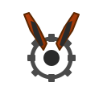

# RustyClaw 🦀🦞

**A lightweight, secure agentic AI runtime written in Rust.**

<p align="center">
  
</p>

<p align="center">
  <a href="https://crates.io/crates/rustyclaw"></a>
  <a href="https://github.com/rexlunae/RustyClaw/actions"></a>
  <a href="LICENSE"></a>
  <a href="https://discord.com/invite/clawd"></a>
</p>

RustyClaw is a drop-in Rust implementation of [OpenClaw](https://github.com/openclaw/openclaw) — the agentic AI assistant that lives in your terminal. It brings the same powerful 30-tool ecosystem with improved security, lower memory footprint, and native performance.

## Why RustyClaw?

| Feature | RustyClaw | OpenClaw (Node.js) |
|---------|-----------|-------------------|
| **Memory usage** | ~15 MB | ~150 MB |
| **Startup time** | <50 ms | ~500 ms |
| **Binary size** | ~8 MB | ~200 MB (with node) |
| **Sandbox isolation** | Built-in (bwrap/Landlock/macOS) | External only |
| **Secrets vault** | AES-256 + TOTP | External (1Password, etc.) |
| **Language** | Rust 🦀 | TypeScript |

### Security-First Design

RustyClaw was built with the assumption that **AI agents can't always be trusted**. The security model includes:

- **Encrypted secrets vault** — AES-256 encryption for API keys, credentials, SSH keys
- **TOTP two-factor authentication** — Optional 2FA for vault access
- **Per-credential access policies** — Always, WithApproval, WithAuth, SkillOnly
- **Sandbox isolation** — Bubblewrap (Linux), Landlock (Linux 5.13+), sandbox-exec (macOS)
- **Credentials directory protection** — Agent tools cannot read the secrets directory

👉 **[Read the Security Model →](docs/SECURITY.md)**

## Quick Start

### Install from crates.io

```bash
cargo install rustyclaw
```

### With optional features

```bash
# Matrix messenger support
cargo install rustyclaw --features matrix

# Browser automation (CDP)
cargo install rustyclaw --features browser

# All publishable features
cargo install rustyclaw --features full
```

> 📝 **Signal messenger** requires building from source. See [BUILDING.md](BUILDING.md).

### Or build from source

```bash
git clone https://github.com/rexlunae/RustyClaw.git
cd RustyClaw
cargo build --release
```

### Run the interactive setup

```bash
rustyclaw onboard
```

### Start chatting

```bash
rustyclaw tui
```

## Features

### 30 Agentic Tools

RustyClaw implements the complete OpenClaw tool ecosystem:

| Category | Tools |
|----------|-------|
| **File Operations** | `read_file`, `write_file`, `edit_file`, `list_directory`, `search_files`, `find_files` |
| **Code Execution** | `execute_command`, `process`, `apply_patch` |
| **Web Access** | `web_fetch`, `web_search` |
| **Memory** | `memory_search`, `memory_get` |
| **Scheduling** | `cron` |
| **Multi-Agent** | `sessions_list`, `sessions_spawn`, `sessions_send`, `sessions_history`, `session_status`, `agents_list` |
| **Secrets** | `secrets_list`, `secrets_get`, `secrets_store` |
| **System** | `gateway`, `message`, `tts` |
| **Devices** | `browser`, `canvas`, `nodes`, `image` |

### Skills System

Load skills from the [OpenClaw ecosystem](https://clawhub.com) or write your own:

```markdown
---
name: my-skill
description: A custom skill
metadata: {"openclaw": {"requires": {"bins": ["git"]}}}
---

# Instructions for the agent

Do something useful with git.
```

Skills support **gating** — require binaries, environment variables, or specific operating systems.

### Multi-Provider Support

Connect to any major AI provider:

- **Anthropic** (Claude 4, Claude Sonnet)
- **OpenAI** (GPT-4, GPT-4o)
- **Google** (Gemini Pro, Gemini Ultra)
- **GitHub Copilot** (with subscription)
- **xAI** (Grok)
- **Ollama** (local models)
- **OpenRouter** (any model)

### Terminal UI

A beautiful TUI with:

- Syntax-highlighted code blocks
- Markdown rendering
- Tab completion
- Slash commands (`/help`, `/clear`, `/model`, `/secrets`)
- Streaming responses

### Gateway Mode

Run as a daemon for integration with other tools:

```bash
rustyclaw gateway start
```

### Messenger Integrations 💬

RustyClaw can be integrated with multiple messaging platforms, making your AI assistant accessible wherever your team communicates:

| Platform | Status | Setup |
|----------|--------|-------|
| **Slack** | ✅ Available | [Quick Start](docs/MESSENGER_SLACK.md) |
| **Discord** | ✅ Available | [Quick Start](docs/MESSENGER_DISCORD.md) |
| **Telegram** | ✅ Available | [Quick Start](docs/MESSENGER_TELEGRAM.md) |
| **Matrix** | ✅ Available | [Quick Start](docs/MESSENGER_MATRIX.md) |

Each messenger integration is available on its own feature branch for easy testing and deployment:

```bash
# Checkout and test Slack integration
git checkout feature/messenger-slack
cargo build --features messenger-slack
rustyclaw gateway start

# Or try Discord
git checkout feature/messenger-discord
cargo build --features messenger-discord
```

**Learn more**: [Messenger Integrations Overview](docs/MESSENGERS.md)

Supports WebSocket connections, heartbeats, and multi-session management.

## Configuration

Configuration lives at `~/.rustyclaw/config.toml`:

```toml
settings_dir = "/Users/myuser/.rustyclaw"
messengers = []
use_secrets = true
secrets_password_protected = true
totp_enabled = true
agent_access = false
agent_name = "A Rusty Little Crab"
message_spacing = 1
tab_width = 5

[model]
provider = "openrouter"
model = "gpt-4.1"
base_url = "https://openrouter.ai/api/v1"

[sandbox]
mode = ""
deny_paths = []
allow_paths = []
```

## Documentation

- **[Building](BUILDING.md)** — Feature flags, Signal support, cross-compilation
- **[Getting Started](docs/getting-started.md)** — Installation and first run
- **[Security Model](docs/SECURITY.md)** — How RustyClaw protects your secrets
- **[Tools Reference](docs/tools.md)** — All 30 tools explained
- **[Skills Guide](docs/skills.md)** — Writing and using skills
- **[Gateway Protocol](docs/gateway.md)** — WebSocket API reference

## Testing

RustyClaw has comprehensive test coverage:

```bash
# Run all tests (330+)
cargo test

# Run specific test suites
cargo test --test tool_execution
cargo test --test gateway_protocol
cargo test --test skill_execution
```

## Community

- 💬 [Discord](https://discord.com/invite/clawd) — Join the OpenClaw community
- 🐛 [Issues](https://github.com/rexlunae/RustyClaw/issues) — Bug reports and feature requests
- 🔧 [ClawhHub](https://clawhub.com) — Find and share skills

## Contributing

Contributions welcome! See [CONTRIBUTING.md](CONTRIBUTING.md) for guidelines.

## License

MIT License — See [LICENSE](LICENSE) for details.

## Acknowledgments

- [OpenClaw](https://github.com/openclaw/openclaw) — The original project and inspiration
- The Rust community for excellent crates

---

<p align="center">
  <i>Built with 🦀 by the RustyClaw contributors</i>
</p>
