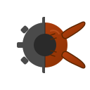

# RustyClaw 🦀🦞

**A lightweight, secure agentic AI runtime written in Rust.**

<p align="center">
  
</p>

<p align="center">
  <a href="https://crates.io/crates/rustyclaw"></a>
  <a href="https://github.com/rexlunae/RustyClaw/actions"></a>
  <a href="LICENSE"></a>
  <a href="https://discord.com/invite/clawd"></a>
</p>

<p align="center">
  <strong>DORA Metrics</strong><br>
  <a href="https://github.com/aecs4u/RustyClaw/actions/workflows/dora-metrics.yml"></a>
  <a href="https://github.com/aecs4u/RustyClaw/actions/workflows/dora-metrics.yml"></a>
  <a href="https://github.com/aecs4u/RustyClaw/actions/workflows/dora-metrics.yml"></a>
  <a href="https://github.com/aecs4u/RustyClaw/actions/workflows/dora-metrics.yml"></a>
</p>

RustyClaw is a drop-in Rust implementation of [OpenClaw](https://github.com/openclaw/openclaw) — the agentic AI assistant that lives in your terminal. It brings the same powerful 30-tool ecosystem with improved security, lower memory footprint, and native performance.

## Why RustyClaw?

| Feature | RustyClaw | OpenClaw (Node.js) |
|---------|-----------|-------------------|
| **Memory usage** | ~15 MB | ~150 MB |
| **Startup time** | <50 ms | ~500 ms |
| **Binary size** | ~8 MB | ~200 MB (with node) |
| **Sandbox modes** | 6 (Landlock+bwrap/Docker/macOS/etc.) | External only |
| **Defense-in-depth** | ✅ Combined kernel + namespace | ❌ |
| **Container isolation** | ✅ Docker with resource limits | ❌ |
| **Secrets vault** | AES-256-GCM + TOTP + WebAuthn | External (1Password, etc.) |
| **Language** | Rust 🦀 | TypeScript |

### Security-First Design 🔒

RustyClaw was built with the assumption that **AI agents can't always be trusted**. The multi-layer security model includes:

#### Defense-in-Depth Sandboxing

RustyClaw offers **6 sandbox modes** with automatic fallback for maximum security:

1. **Landlock+Bubblewrap** (Linux) — Combined kernel LSM + namespace isolation for defense-in-depth
2. **Landlock** (Linux 5.13+) — Kernel-enforced filesystem access control
3. **Bubblewrap** (Linux) — User namespace isolation with mount/network restrictions
4. **Docker** (Cross-platform) — Container isolation with resource limits (2GB memory, 1 CPU)
5. **macOS Sandbox** (macOS) — Apple's sandbox-exec with TinyScheme profiles
6. **Path Validation** (Fallback) — Allowlist-based path checking

The sandbox automatically selects the strongest available mode for your platform.

👉 **[Sandbox Documentation →](docs/SANDBOX.md)**

#### Secrets Management

- **Encrypted secrets vault** — AES-256-GCM encryption for API keys, credentials, SSH keys
- **TOTP two-factor authentication** — Optional 2FA for vault access with recovery codes
- **Per-credential access policies** — Always, WithApproval, WithAuth, SkillOnly
- **Credentials directory protection** — Sandboxed tools cannot access `~/.rustyclaw/secrets/`
- **WebAuthn support** — Hardware key authentication (YubiKey, etc.)

👉 **[Complete Security Model →](docs/SECURITY.md)**

## Quick Start

### Install from crates.io

```bash
cargo install rustyclaw
```

### With optional features

```bash
# Matrix messenger support
cargo install rustyclaw --features matrix

# Browser automation (CDP)
cargo install rustyclaw --features browser

# All publishable features
cargo install rustyclaw --features full
```

> 📝 **Signal messenger** requires building from source. See [BUILDING.md](docs/BUILDING.md).

### Or build from source

```bash
git clone https://github.com/rexlunae/RustyClaw.git
cd RustyClaw
cargo build --release
```

### Run the interactive setup

```bash
rustyclaw onboard
```

### Start chatting

```bash
rustyclaw tui
```

## Recent Enhancements ✨

**February 2026** — Phase 1 (Quick Wins) complete! All 4 priority features shipped:

### 🎉 Phase 1 Features (100% Complete)
- ⚡ **Multi-Provider LLM Failover** — Automatic failover across providers with 3 strategies (priority, round-robin, cost-optimized), error classification, and cost tracking
- 🛡️ **Safety Layer Consolidation** — Unified security defense with 4 components: Sanitizer, Validator, Policy Engine (Warn/Block/Sanitize/Ignore), and Leak Detector (API keys, passwords, tokens, private keys, PII)
- 📊 **Context Compaction** — Intelligent message history compaction (sliding window + importance scoring) enabling indefinite conversation length
- 🔐 **Local Embeddings** — Privacy-preserving offline embeddings via fastembed-rs (384-dim) with automatic fallback to OpenAI (1536-dim)

### Earlier Enhancements
- 🛡️ **Defense-in-Depth Sandboxing** — Combined Landlock+Bubblewrap mode for kernel-enforced + namespace isolation
- 🐳 **Docker Container Support** — Cross-platform sandboxing with Alpine Linux, resource limits, and credential injection
- 🎯 **Prioritized Development Roadmap** — Complexity-based prioritization of 44 features with ecosystem analysis
- 📨 **DORA Metrics Tracking** — First project in ecosystem with DevOps performance metrics
- 💬 **Messenger Integrations** — Slack, Discord, Telegram, Matrix, Google Chat, Teams, Mattermost support

See [docs/ROADMAP.md](docs/ROADMAP.md) for Phase 2 features (Routines Engine, Hybrid Search, MCP Support) and the complete development plan.

## Features

### 30 Agentic Tools

RustyClaw implements the complete OpenClaw tool ecosystem:

| Category | Tools |
|----------|-------|
| **File Operations** | `read_file`, `write_file`, `edit_file`, `list_directory`, `search_files`, `find_files` |
| **Code Execution** | `execute_command`, `process`, `apply_patch` |
| **Web Access** | `web_fetch`, `web_search` |
| **Memory** | `memory_search`, `memory_get` |
| **Scheduling** | `cron` |
| **Multi-Agent** | `sessions_list`, `sessions_spawn`, `sessions_send`, `sessions_history`, `session_status`, `agents_list` |
| **Secrets** | `secrets_list`, `secrets_get`, `secrets_store` |
| **System** | `gateway`, `message`, `tts` |
| **Devices** | `browser`, `canvas`, `nodes`, `image` |

### Skills System

Load skills from the [OpenClaw ecosystem](https://clawhub.com) or write your own:

```markdown
---
name: my-skill
description: A custom skill
metadata: {"openclaw": {"requires": {"bins": ["git"]}}}
---

# Instructions for the agent

Do something useful with git.
```

Skills support **gating** — require binaries, environment variables, or specific operating systems.

### Multi-Provider Support

Connect to any major AI provider with automatic failover:

- **Anthropic** (Claude 4, Claude Sonnet)
- **OpenAI** (GPT-4, GPT-4o)
- **Google** (Gemini Pro, Gemini Ultra)
- **GitHub Copilot** (with subscription)
- **xAI** (Grok)
- **Ollama** (local models)
- **OpenRouter** (any model)

**NEW**: Multi-provider failover with 3 strategies:
```toml
[failover]
enabled = true
strategy = "priority"  # or "round-robin", "cost-optimized"
providers = [
  { provider = "anthropic", priority = 1 },
  { provider = "openai", priority = 2 }
]
```

### Embeddings & Semantic Search

Generate vector embeddings locally or via cloud with automatic failover:

- **Local Embeddings** (fastembed-rs) — Privacy-preserving, offline, 384-dim (all-MiniLM-L6-v2)
- **OpenAI Embeddings** — Higher quality, 1536-dim (text-embedding-3-small)
- **Fallback Provider** — Try local first, fallback to OpenAI on error

```toml
[embeddings]
provider = "fallback"  # "local", "openai", or "fallback"
model = "all-MiniLM-L6-v2"
cache_dir = "~/.cache/rustyclaw/embeddings"
```

Build with `--features local-embeddings` for offline support.

### Advanced Memory Systems

RustyClaw includes multiple memory layers for intelligent context management:

- **File-Based Memory** — Manual facts in AGENTS.md with BM25 keyword search
- **Structured Memory** — SQLite database with auto-extracted facts, confidence scoring, deduplication
- **Context Compaction** — Intelligent message history compaction with sliding window & importance scoring
- **Indefinite Conversations** — Never hit context limits with automatic compaction strategies

```toml
[context_compaction]
enabled = true
strategy = "hybrid"  # "sliding_window", "importance", or "hybrid"
window_size = 50

[structured_memory]
enabled = true
db_path = "memory/facts.db"
min_confidence = 0.5
max_facts = 10000
```

### Terminal UI

A beautiful TUI with:

- Syntax-highlighted code blocks
- Markdown rendering
- Tab completion
- Slash commands (`/help`, `/clear`, `/model`, `/secrets`)
- Streaming responses

### Gateway Mode

Run as a daemon for integration with other tools:

```bash
rustyclaw gateway start
```

### Messenger Integrations 💬

RustyClaw can be integrated with multiple messaging platforms, making your AI assistant accessible wherever your team communicates:

| Platform | Status | Setup |
|----------|--------|-------|
| **Slack** | ✅ Available | [Quick Start](docs/MESSENGER_SLACK.md) |
| **Discord** | ✅ Available | [Quick Start](docs/MESSENGER_DISCORD.md) |
| **Telegram** | ✅ Available | [Quick Start](docs/MESSENGER_TELEGRAM.md) |
| **Matrix** | ✅ Available | [Quick Start](docs/MESSENGER_MATRIX.md) |

Each messenger integration is available on its own feature branch for easy testing and deployment:

```bash
# Checkout and test Slack integration
git checkout feature/messenger-slack
cargo build --features messenger-slack
rustyclaw gateway start

# Or try Discord
git checkout feature/messenger-discord
cargo build --features messenger-discord
```

**Learn more**: [Messenger Integrations Overview](docs/MESSENGERS.md)

Supports WebSocket connections, heartbeats, and multi-session management.

## Configuration

Configuration lives at `~/.rustyclaw/config.toml`:

```toml
settings_dir = "/Users/myuser/.rustyclaw"
messengers = []
use_secrets = true
secrets_password_protected = true
totp_enabled = true
agent_access = false
agent_name = "A Rusty Little Crab"
message_spacing = 1
tab_width = 5

[model]
provider = "openrouter"
model = "gpt-4.1"
base_url = "https://openrouter.ai/api/v1"

[sandbox]
# Mode: "auto" (default), "landlock+bwrap", "docker", "landlock", "bwrap", "macos", "path", "none"
mode = "auto"
deny_paths = ["/etc/passwd", "/etc/shadow"]
allow_paths = ["/tmp", "/var/tmp"]

# Docker-specific settings (when mode = "docker")
docker_image = "alpine:latest"
docker_memory_limit_mb = 2048
docker_cpu_shares = 1024

# Multi-provider failover (Phase 1)
[failover]
enabled = true
strategy = "priority"  # "priority", "round-robin", or "cost-optimized"
providers = [
  { provider = "anthropic", priority = 1 },
  { provider = "openai", priority = 2 }
]

# Context compaction (Phase 1)
[context_compaction]
enabled = true
strategy = "hybrid"  # "sliding_window", "importance", or "hybrid"
window_size = 50

# Structured memory (Phase 1)
[structured_memory]
enabled = true
db_path = "memory/facts.db"
min_confidence = 0.5

# Local embeddings (Phase 1)
[embeddings]
provider = "fallback"  # "local", "openai", or "fallback"
model = "all-MiniLM-L6-v2"

# Unified safety layer (Phase 1)
[safety]
prompt_injection_policy = "warn"  # "ignore", "warn", "block", or "sanitize"
leak_detection_policy = "warn"
prompt_sensitivity = 0.7
```

See [docs/SANDBOX.md](docs/SANDBOX.md) for detailed sandbox configuration options.

## Documentation

### Getting Started
- **[Building](docs/BUILDING.md)** — Feature flags, Signal support, cross-compilation
- **[Getting Started](docs/getting-started.md)** — Installation and first run
- **[Configuration](docs/configuration.md)** — Settings and environment setup

### Security & Architecture
- **[Security Model](docs/SECURITY.md)** — Comprehensive security architecture
- **[Sandbox Modes](docs/SANDBOX.md)** — 6 sandbox isolation strategies explained
- **[Development Roadmap](docs/ROADMAP.md)** — 3-phase feature plan with 15+ enhancements

### Features & Integration
- **[Tools Reference](docs/tools.md)** — All 30 agentic tools explained
- **[Skills Guide](docs/skills.md)** — Writing and using skills
- **[Gateway Protocol](docs/gateway.md)** — WebSocket API reference
- **[Messenger Integrations](docs/MESSENGERS.md)** — Slack, Discord, Telegram, Matrix setup

## Testing

RustyClaw has comprehensive test coverage:

```bash
# Run all tests (330+)
cargo test

# Run specific test suites
cargo test --test tool_execution
cargo test --test gateway_protocol
cargo test --test skill_execution
```

## Community

- 💬 [Discord](https://discord.com/invite/clawd) — Join the OpenClaw community
- 🐛 [Issues](https://github.com/rexlunae/RustyClaw/issues) — Bug reports and feature requests
- 🔧 [ClawhHub](https://clawhub.com) — Find and share skills

## Contributing

Contributions welcome! We have a comprehensive prioritized roadmap based on ecosystem analysis:

- 🎯 **[Roadmap Index](ROADMAP_INDEX.md)** — Start here for navigation
- 📋 **[Development Roadmap](DEVELOPMENT_ROADMAP.md)** — Complete analysis of 44 features (#51-#94)
- ⚡ **[Quick Reference](ROADMAP_SUMMARY.md)** — Priority tiers and effort estimates
- 📊 **[Prioritization Matrix](PRIORITIZATION_MATRIX.md)** — Complexity scoring and risk assessment
- 🏃 **[Sprint Plan](SPRINT_PLAN.md)** — 16-week actionable implementation plan
- 🐛 **[Open Issues](https://github.com/aecs4u/RustyClaw/issues)** — 102 tracked issues
- 📖 **[Contributing Guide](docs/CONTRIBUTING.md)** — Development guidelines and PR process

**Phase 1 Complete** ✅ — All Quick Wins shipped (Feb 2026):
- ✅ #50 — Multi-provider LLM failover
- ✅ #51 — Context Compaction
- ✅ #52 — Structured Memory with SQLite backend
- ✅ #53 — Gateway Service Lifecycle Management
- ✅ #54 — Safety Layer Consolidation

**Phase 2 Features (Start Here):**
- #56 — Hybrid search with BM25+Vector (2-3 weeks)
- #58 — MCP (Model Context Protocol) support (2-3 weeks)
- #66 — Sub-agent spawning for parallel tasks (2-3 weeks)
- Routines Engine — Cron, event triggers, webhooks (2-3 weeks)

**Also completed**: #42 (Discord), #45-46 (Google Chat, Mattermost), #47-49 (P0 features)

See [ROADMAP_SUMMARY.md](ROADMAP_SUMMARY.md) for complete prioritization and [individual issues](https://github.com/aecs4u/RustyClaw/issues) for implementation details.

## License

MIT License — See [LICENSE](LICENSE) for details.

## Ecosystem

RustyClaw is part of a growing ecosystem of agentic AI assistants. We actively study and borrow ideas from sibling projects to deliver the best possible experience.

| Project | Language | Stars | Contributors | Commits | Source LOC | Channels | License |
|---------|----------|------:|:------------:|--------:|-----------:|---------:|---------|
| [**OpenClaw**](https://github.com/openclaw/openclaw) | TypeScript | 200k+ | 638 | 10,835 | ~219k | 18+ | MIT |
| [**AutoGPT**](https://github.com/Significant-Gravitas/AutoGPT) | Python+TS | 182k+ | 818 | 7,877 | ~84k | — | Polyform Shield / MIT |
| [**PicoClaw**](https://github.com/sipeed/picoclaw) | Go | 13k+ | 55 | 250 | ~25k | 10+ | MIT |
| [**Moltis**](https://github.com/moltis-org/moltis) | Rust | 981 | 7 | 1,182 | ~140k | 2 | MIT |
| [**MicroClaw**](https://github.com/microclaw/microclaw) | Rust | 168 | 5 | 232 | ~31k | 5 | MIT |
| [**Carapace**](https://github.com/puremachinery/carapace) | Rust | 32 | 3 | 266 | ~114k | 6 | Apache-2.0 |
| [**RustyClaw**](https://github.com/aecs4u/RustyClaw) | Rust | 2 | 5 | 286 | ~40k | 6 | MIT |

### What each project does best

- **[OpenClaw](https://github.com/openclaw/openclaw)** — The reference implementation. Most feature-complete with 51 skills, 18+ messenger channels (WhatsApp, iMessage, Teams, LINE, IRC, Twitch, Nostr...), browser automation, canvas workspace, iOS/Android companion apps, and macOS menu bar integration.

- **[AutoGPT](https://github.com/Significant-Gravitas/AutoGPT)** — Visual agent platform with graph-based workflow execution, 260+ integration blocks, and a marketplace for sharing agents. Pioneered autonomous agent loops with Prometheus monitoring, webhook triggers, nested agent composition, and 35+ SaaS integrations.

- **[PicoClaw](https://github.com/sipeed/picoclaw)** — Ultra-lightweight Go implementation. Runs on $10 hardware with <10MB RAM. Unique hardware tool support (I2C, SPI, USB hotplug) for embedded/IoT use cases. Largest community (13k+ stars, 112 issues).

- **[Moltis](https://github.com/moltis-org/moltis)** — Production-grade Rust gateway with 27 specialized crates. Best-in-class MCP support (stdio + HTTP/SSE + OAuth 2.1), 5+ TTS and 8+ STT providers, container sandboxing (Docker/Podman/OrbStack/Apple Container), extensible hook system with 13 event types.

- **[MicroClaw](https://github.com/microclaw/microclaw)** — Lean Rust implementation with channel-agnostic core. Two-layer memory system with auto-reflector that extracts durable facts from conversations. Clean MCP integration, per-chat working directory isolation, and embedded React web UI.

- **[Carapace](https://github.com/puremachinery/carapace)** — Security-hardened Rust gateway. WASM plugin system with Ed25519 signatures, capability-based sandboxing, mTLS, mDNS discovery, LLM-based prompt injection classifier, CSRF protection, and structured audit logging.

- **[RustyClaw](https://github.com/aecs4u/RustyClaw)** — Security-first Rust implementation with 6 sandbox modes (Landlock+bwrap, Docker, macOS Seatbelt), AES-256-GCM encrypted vault with TOTP/WebAuthn, beautiful TUI, and unique Gmail/Matrix integrations.

## Acknowledgments

- [OpenClaw](https://github.com/openclaw/openclaw) — The original project and inspiration
- [AutoGPT](https://github.com/Significant-Gravitas/AutoGPT), [Carapace](https://github.com/puremachinery/carapace), [Moltis](https://github.com/moltis-org/moltis), [PicoClaw](https://github.com/sipeed/picoclaw), [MicroClaw](https://github.com/microclaw/microclaw) — Sibling implementations we learn from
- The Rust community for excellent crates

---

<p align="center">
  <i>Built with 🦀 by the RustyClaw contributors</i>
</p>
