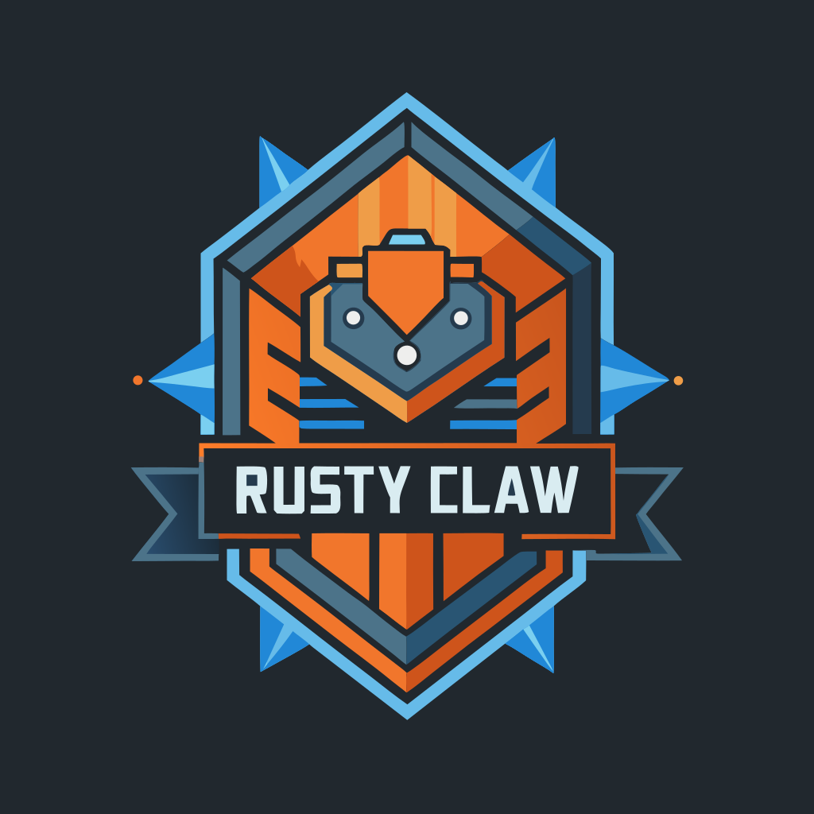

<p align="center">
  
</p>

<h1 align="center">RustyClaw 🦀🦞</h1>

<p align="center">
  <strong>The secure, open-source operating system for AI agents</strong>
</p>

<p align="center">
  <a href="https://crates.io/crates/rustyclaw"></a>
  <a href="https://github.com/rexlunae/RustyClaw/actions"></a>
  <a href="LICENSE"></a>
  
  <a href="https://discord.com/invite/clawd"></a>
</p>

<p align="center">
  <a href="#quick-start">Quick Start</a> •
  <a href="#building-from-source">Building</a> •
  <a href="#why-rustyclaw">Why RustyClaw</a> •
  <a href="#features">Features</a> •
  <a href="#security">Security</a> •
  <a href="#architecture">Architecture</a>
</p>

## What is RustyClaw?

RustyClaw is an **agentic AI operating system** — a complete runtime for deploying, orchestrating, and securing AI agents. It provides everything agents need: tools, memory, isolation, scheduling, multi-agent coordination, and secure credential management.

Think of it as **Linux for AI agents**: a stable, secure foundation that handles the hard infrastructure problems so you can focus on what your agents actually do.

```
┌─────────────────────────────────────────────────────────────────────┐
│                         YOUR AI AGENTS                              │
├─────────────────────────────────────────────────────────────────────┤
│  Tools     │  Memory    │  Channels  │  Sessions  │  Scheduling    │
│  (30+)     │  (files,   │  (Signal,  │  (spawn,   │  (cron,        │
│            │   search)  │   Matrix)  │   steer)   │   heartbeat)   │
├─────────────────────────────────────────────────────────────────────┤
│                    SECURITY & ISOLATION LAYER                       │
│   PromptGuard · LeakDetector · Sandbox · Encrypted Vault · SSRF    │
├─────────────────────────────────────────────────────────────────────┤
│                     RUSTYCLAW RUNTIME (Rust)                        │
│            ~15MB RAM · <50ms startup · Single binary                │
└─────────────────────────────────────────────────────────────────────┘
```

## Why RustyClaw?

### 🔒 Security-First Design

AI agents are powerful but risky. They can be tricked into leaking secrets, executing malicious commands, or exfiltrating data. RustyClaw is built with the assumption that **agents can't always be trusted**.

| Defense Layer | What It Does |
|---------------|--------------|
| **PromptGuard** | Detects prompt injection attacks (system override, role confusion, jailbreaks) |
| **LeakDetector** | Blocks credential exfiltration via API keys, tokens, SSH keys in outputs |
| **Sandbox Isolation** | Bubblewrap (Linux), Landlock (5.13+), sandbox-exec (macOS) |
| **SSRF Protection** | Blocks requests to private IPs, metadata endpoints |
| **Encrypted Vault** | AES-256 secrets with optional TOTP 2FA |
| **HTTP Request Scanning** | Validates URLs, headers, and bodies before outbound requests |

No other agent framework in the ecosystem has this level of built-in security. Most have **zero prompt injection defense**.

### ⚡ Lightweight & Fast

| Metric | RustyClaw | OpenClaw (Node.js) | Python Agents |
|--------|-----------|-------------------|---------------|
| **Memory** | ~15 MB | ~150 MB | ~100+ MB |
| **Startup** | <50 ms | ~500 ms | ~1s+ |
| **Binary** | ~8 MB | ~200 MB (w/ node) | N/A |
| **Dependencies** | 0 (single binary) | node_modules | venv |

Run on a $10 Raspberry Pi or a $500/month cloud instance. Same binary.

### 🔌 Provider Agnostic

Connect to any LLM provider without code changes:

- **Anthropic** (Claude Opus, Sonnet, Haiku)
- **OpenAI** (GPT-4o, o1, o3)
- **Google** (Gemini Pro, Ultra)
- **GitHub Copilot** (with subscription)
- **xAI** (Grok)
- **Ollama** (local models)
- **OpenRouter** (200+ models)
- **Any OpenAI-compatible endpoint**

### 🤖 Multi-Agent Orchestration

Spawn sub-agents, steer them mid-task, coordinate across sessions:

```rust
// Spawn a research agent
let research = spawn_agent("Summarize the latest papers on RLHF", AgentConfig {
    model: "claude-sonnet",
    timeout: Duration::minutes(10),
    ..default()
});

// Spawn a coding agent in parallel
let coder = spawn_agent("Implement the algorithm from the research", AgentConfig {
    model: "gpt-4o",
    ..default()
});

// Steer mid-execution
research.steer("Focus specifically on Constitutional AI approaches");
```

## Quick Start

### One-Line Setup (Everything)

Install RustyClaw plus all supporting tools (uv, Ollama, Node.js, Exo):

```bash
# From a clone
git clone https://github.com/rexlunae/RustyClaw.git && cd RustyClaw
./scripts/setup.sh

# Or pick components
./scripts/setup.sh --skip exo          # skip exo
./scripts/setup.sh --only rust rustyclaw  # just Rust + RustyClaw
```

### Install RustyClaw Only

```bash
cargo install rustyclaw
```

Or download a pre-built binary from [Releases](https://github.com/rexlunae/RustyClaw/releases).

### Configure

```bash
rustyclaw onboard
```

This interactive wizard sets up:
- API key for your preferred provider
- Encrypted secrets vault
- Workspace directory
- **Messaging** via [Beeper](https://www.beeper.com) (WhatsApp, Telegram, Signal, Discord, Slack, iMessage, and more)
- Recommended skills from ClawHub

### Run

```bash
# Interactive terminal UI
rustyclaw tui

# Desktop UI
rustyclaw desktop

# Or run as a daemon for integrations
rustyclaw gateway start
```

The desktop client uses the same configured gateway as `rustyclaw tui`. You can
override it at launch time with:

```bash
rustyclaw desktop --url ssh://127.0.0.1:2222
```

By default, both `rustyclaw tui` and `rustyclaw desktop` connect to the SSH-based
gateway transport at `ssh://127.0.0.1:2222` unless your config overrides it.

## Messaging

RustyClaw uses **skills** for messaging rather than compiled-in integrations. This means:
- ✅ No recompilation to add new platforms
- ✅ Single skill handles 15+ platforms
- ✅ Privacy-preserving local API

The recommended approach uses **Beeper** + the **claw-me-maybe** skill:

```bash
# 1. Install Beeper Desktop: https://www.beeper.com/download
# 2. Enable Desktop API in Beeper Settings → Developers
# 3. Install the skill:
clawhub install claw-me-maybe
```

**Supported platforms:** WhatsApp, Telegram, Signal, Discord, Slack, iMessage, Instagram, LinkedIn, Facebook Messenger, Google Messages, Google Chat, X (Twitter) DMs

The `rustyclaw onboard` wizard walks you through this setup step-by-step.

## Building from Source

RustyClaw is organized as a **Cargo workspace** with four crates:

| Crate | Path | Description |
|-------|------|-------------|
| **rustyclaw-core** | `crates/rustyclaw-core/` | Core library — config, gateway, tools, secrets, providers |
| **rustyclaw-cli** | `crates/rustyclaw-cli/` | CLI binaries (`rustyclaw` and `rustyclaw-gateway`) |
| **rustyclaw-tui** | `crates/rustyclaw-tui/` | Terminal UI client (ratatui) |
| **rustyclaw-desktop** | `crates/rustyclaw-desktop/` | Desktop UI client (Dioxus) |

### Prerequisites

- **Rust 1.85+** (Edition 2024)
- **OpenSSL** development headers (vendored by default)

```bash
# macOS — no extra deps needed for the TUI; desktop uses the system WebView

# Ubuntu / Debian
sudo apt install build-essential pkg-config

# Fedora / RHEL
sudo dnf install gcc openssl-devel
```

For the desktop client you also need native webview/GTK libraries on Linux:

```bash
# Ubuntu / Debian
sudo apt install libgtk-3-dev libwebkit2gtk-4.1-dev

# Fedora / RHEL
sudo dnf install gtk3-devel webkit2gtk4.1-devel
```

### Build the Workspace

```bash
git clone https://github.com/rexlunae/RustyClaw.git
cd RustyClaw

# Debug build (fast compile, all crates)
cargo build --workspace

# Release build (optimized, ~11 MB binary with LTO)
cargo build --release
```

Binaries are produced at:
- `target/release/rustyclaw` — main CLI + TUI
- `target/release/rustyclaw-gateway` — standalone gateway daemon
- `target/release/rustyclaw-desktop` — desktop GUI client

You can launch the desktop client either directly or through the unified CLI:

```bash
# Direct desktop binary
cargo run -p rustyclaw-desktop

# Unified CLI entrypoint (uses the same SSH gateway default as the TUI)
cargo run -p rustyclaw -- desktop
```

### Feature Flags

Features are split across the workspace crates:

**rustyclaw-cli** (binary crate):

| Feature | Description | Default |
|---------|-------------|---------|
| `tui` | Terminal UI (ratatui + crossterm) | ✅ |
| `desktop` | Desktop UI launcher (`rustyclaw desktop`) | ✅ |

**rustyclaw-core** (library crate):

| Feature | Description | Default |
|---------|-------------|---------|
| `web-tools` | HTML parsing via scraper + html2md | ✅ |
| `matrix` | Matrix messenger support | |
| `browser` | CDP browser automation (chromiumoxide) | |
| `full` | web-tools + matrix + browser | |
| `signal` | Signal messenger (source-only, see below) | |

```bash
# Default (TUI + web tools)
cargo build --release

# Headless gateway only (no TUI)
cargo build --release -p rustyclaw-cli --no-default-features

# With Matrix support
cargo build --release --features rustyclaw-core/matrix

# Everything enabled
cargo build --release --features rustyclaw-core/full

# Build only the core library
cargo check -p rustyclaw-core

# Build only the TUI client
cargo check -p rustyclaw-tui

# Build only the desktop client
cargo check -p rustyclaw-desktop
```

### Running Tests

```bash
# All workspace tests
cargo test --workspace

# Core library tests only
cargo test -p rustyclaw-core

# TUI client tests only
cargo test -p rustyclaw-tui
```

### Cross-Compilation (Raspberry Pi)

Build a headless gateway for ARM using [cross](https://github.com/cross-rs/cross):

```bash
cargo install cross --git https://github.com/cross-rs/cross

# 64-bit (Pi 3/4/5)
cross build --release --target aarch64-unknown-linux-gnu \
  -p rustyclaw-cli --no-default-features

# 32-bit (Pi 2/3)
cross build --release --target armv7-unknown-linux-gnueabihf \
  -p rustyclaw-cli --no-default-features
```

### Signal Messenger (Source Only)

Signal requires git-only dependencies not on crates.io. See [BUILDING.md](BUILDING.md) for detailed instructions on enabling Signal support.

## Features

### 🛠️ 30+ Agentic Tools

Everything an agent needs to be useful:

| Category | Tools |
|----------|-------|
| **Files** | `read_file`, `write_file`, `edit_file`, `list_directory`, `search_files` |
| **Execution** | `execute_command`, `process`, `apply_patch` |
| **Web** | `web_fetch`, `web_search`, `browser` |
| **Memory** | `memory_search`, `memory_get` |
| **Scheduling** | `cron`, heartbeat system |
| **Multi-Agent** | `sessions_spawn`, `sessions_send`, `sessions_steer` |
| **Secrets** | `secrets_list`, `secrets_get`, `secrets_store` |
| **Devices** | `canvas`, `nodes`, `tts` |

### 📚 Skills System

Extend capabilities with skills — markdown files that teach agents new abilities:

```yaml
---
name: github
description: GitHub operations via gh CLI
requires:
  bins: [gh]
  env: [GITHUB_TOKEN]
---

# GitHub Skill

You can use the `gh` CLI to manage issues, PRs, and repos...
```

Skills support **dependency gating**: if requirements aren't met, the agent sees what's missing and can try to install it.

Browse community skills at [ClawHub](https://clawhub.com).

### 💬 Multi-Channel Support

Connect agents to the platforms where work happens:

- **Signal** (secure messaging)
- **Matrix** (federated chat)
- **Telegram** (bot API)
- **Discord** (bot API)
- **Slack** (with app tokens)
- **WhatsApp** (QR code pairing)
- **HTTP webhooks** (custom integrations)

### 🧠 Memory & Context

Two-layer memory system for long-running agents:

- **MEMORY.md** — Long-term facts (LLM-curated)
- **HISTORY.md** — Grep-searchable event log

Memory consolidation runs automatically, keeping context windows manageable while preserving important information.

### ⏰ Scheduling & Automation

Built-in cron system for recurring tasks:

```json
{
  "schedule": { "kind": "cron", "expr": "0 9 * * MON" },
  "payload": {
    "kind": "agentTurn",
    "message": "Check email and summarize anything urgent"
  }
}
```

Heartbeat system for proactive monitoring without explicit schedules.

## Security

RustyClaw's security model is documented in detail:

- **[SECURITY.md](docs/SECURITY.md)** — Full security architecture
- **[DEPLOYMENT.md](docs/DEPLOYMENT.md)** — Production deployment guide
- **[SANDBOX.md](docs/SANDBOX.md)** — Sandbox configuration
- **[CLIENT_SPEC.md](docs/CLIENT_SPEC.md)** — WebSocket protocol for custom clients

### Quick Overview

```
User Input
    │
    ▼
┌───────────────┐
│ InputValidator│ ─── Length, encoding, padding attacks
└───────┬───────┘
        │
        ▼
┌───────────────┐
│  PromptGuard  │ ─── 6 injection categories, configurable sensitivity
└───────┬───────┘
        │
        ▼
┌───────────────┐
│    Agent      │ ─── Sandboxed execution
└───────┬───────┘
        │
        ▼
┌───────────────┐
│ LeakDetector  │ ─── Blocks secrets in outputs/requests
└───────┬───────┘
        │
        ▼
┌───────────────┐
│ SSRF Validator│ ─── Blocks private IPs, metadata endpoints
└───────────────┘
```

### Encrypted Secrets Vault

API keys, tokens, and credentials are stored encrypted:

- AES-256-GCM encryption
- Optional TOTP 2FA for vault access
- Per-credential access policies (Always, WithApproval, WithAuth, SkillOnly)
- Agent tools cannot read the vault directory

## Architecture

RustyClaw follows a **trait-driven architecture** — core systems are pluggable:

```rust
// Swap providers without changing agent code
trait LlmProvider {
    async fn chat(&self, messages: &[Message]) -> Response;
}

// Swap channels without changing agent code
trait Channel {
    async fn receive(&self) -> InboundMessage;
    async fn send(&self, msg: OutboundMessage);
}

// Swap runtimes for different isolation levels
trait RuntimeAdapter {
    async fn execute(&self, command: Command) -> Output;
}
```

### Workspace Layout

```
RustyClaw/
├── Cargo.toml              # Workspace root
├── crates/
│   ├── rustyclaw-core/     # Core library (config, gateway, tools, secrets, providers)
│   ├── rustyclaw-cli/      # CLI binaries (rustyclaw + rustyclaw-gateway)
│   └── rustyclaw-tui/      # Terminal UI client (ratatui)
├── docs/                   # Architecture, security, and client spec docs
├── tests/                  # Integration and E2E tests
└── website/                # Project website and install scripts
```

### Core Components

| Component | Crate | Responsibility |
|-----------|-------|----------------|
| **Gateway** | core | Daemon process, WebSocket protocol, session management |
| **Agent Loop** | core | LLM calls, tool execution, context management |
| **Tool Registry** | core | 30+ tools with dynamic registration and validation |
| **Session Manager** | core | Multi-agent coordination, history, spawn/steer |
| **Security Layer** | core | PromptGuard, LeakDetector, SSRF, sandbox |
| **Secrets Vault** | core | AES-256 encrypted credential storage, access policies |
| **Terminal UI** | tui | Interactive chat, tool approval, config management |
| **CLI** | cli | Command-line entry point, onboarding wizard |

## Comparison

| Feature | RustyClaw | OpenClaw | ZeroClaw | nanobot |
|---------|-----------|----------|----------|---------|
| **Language** | Rust | TypeScript | Rust | Python |
| **Memory** | ~15 MB | ~150 MB | <5 MB | ~100 MB |
| **Startup** | <50 ms | ~500 ms | <10 ms | ~1s |
| **PromptGuard** | ✅ | ❌ | ❌ | ❌ |
| **LeakDetector** | ✅ | ❌ | ❌ | ❌ |
| **Encrypted Vault** | ✅ | External | ✅ | ❌ |
| **Multi-Agent** | ✅ | ✅ | ✅ | ✅ |
| **Skills** | ✅ | ✅ | ✅ | ✅ |

## Contributing

We welcome contributions! See [CONTRIBUTING.md](CONTRIBUTING.md) for guidelines.

Key areas we're focused on:

- **Security hardening** — More detection patterns, sandbox improvements
- **New channels** — iMessage, Teams, Zulip
- **Performance** — Even lower memory, faster startup
- **Skills ecosystem** — More community skills

## License

MIT License. See [LICENSE](LICENSE).

## Acknowledgments

RustyClaw builds on ideas from:

- [OpenClaw](https://github.com/openclaw/openclaw) — The original agentic AI assistant
- [IronClaw](https://github.com/nearai/ironclaw) — Security patterns and HTTP scanning
- [nanobot](https://github.com/HKUDS/nanobot) — Memory consolidation and progressive skill loading
- [ZeroClaw](https://github.com/zeroclaw-labs/zeroclaw) — RuntimeAdapter and observability patterns

---

<p align="center">
  <strong>Built with 🦀 by the RustyClaw community</strong>
</p>
